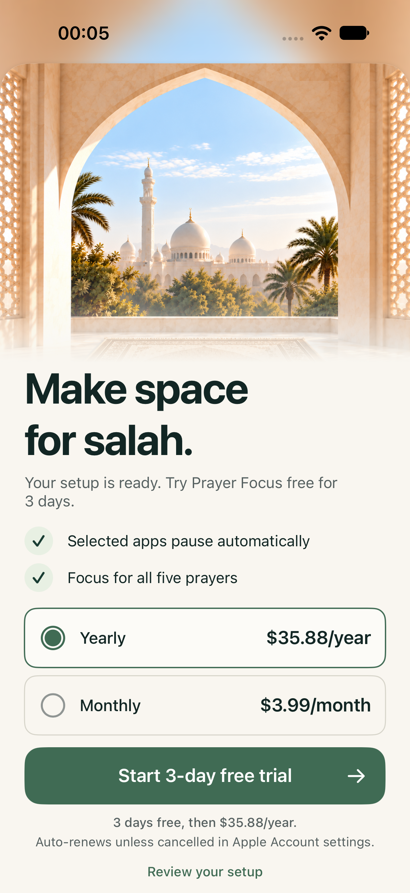
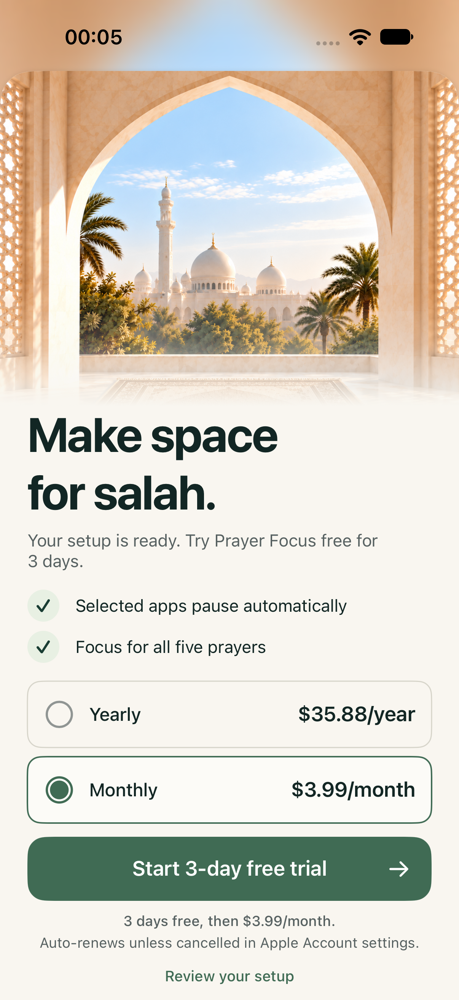

# Setup and three-day trial QA — October 5, 2026

Implemented the updated native flow: configure the app → membership → Apple-confirmed three-day trial → monthly or yearly auto-renewal. Setup completion, city, calculation method, notification preference, prayer switches and opaque Family Controls app selection persist locally. Cancelling a purchase preserves configuration and leaves membership locked. Review your setup remains available on the paywall.

## Verified locally

After incorporating the daily affirmation widgets from main, `xcodebuild test -testPlan PrayerFocus` completed successfully with **21 passed, 0 failed, 0 skipped** on iPhone 18 Pro, iOS 27, using the local StoreKit test plan. [Machine-readable summary](qa-evidence/setup-trial-2026-10-04/test-summary.json). Result bundle: `/tmp/prayer-focus-pr-integrated-trial.xcresult`; log: `/tmp/prayer-focus-pr-integrated-trial.log`.

- 3 setup tests: incomplete selections cannot advance; configuration survives relaunch; prayer switches and app-selection data persist and clear.
- 7 StoreKit tests: both products expose exactly three free days; a verified trial grants access; forced renewal produces a paid transaction of $3.99 for a month or $35.88 for a year; cancelled, pending and unavailable purchases grant no access; restore works; expiration removes access and prevents another introductory trial in the same group.
- 6 existing prayer-session tests continue to pass.
- 5 native UI tests: setup precedes membership and persists; disclosures follow the selected plan; swipe dismissal cannot bypass membership; Privacy opens and dismisses; an Apple-confirmed local trial opens Today.

Debug and Release simulator builds succeeded. The local `.storekit` fixture is included only in test bundles and is absent from the Release app. `git diff --check` and strict Swift formatting/lint passed. The Release build also includes the widget extension; log: `/tmp/prayer-focus-pr-integrated-release.log`. No production payment or App Store Connect change was made.

The purchase tests observe and finish StoreKit transaction updates, matching the app's launch behavior. Fresh-account UI tests use a temporary copy of the local catalog with a fresh subscription-group identity for each case, retaining both plans in the same group; this isolates introductory eligibility from a previous unit-test process. Trial ineligibility within one group remains covered by the unit test. Injected cancellation/product-loading errors are intentional test cases. Xcode's forced-expiration test uses `AppStore.sync()` to refresh its local receipt before checking entitlements; production access continues to use verified StoreKit entitlements and transaction updates.

The separate `PrayerFocusStoreKit` plan passed **5 tests, 0 failed, 0 skipped** after the merge. [Widget membership summary](qa-evidence/setup-trial-2026-10-04/widget-membership-summary.json). It covers verified widget snapshots, recorded expiration, a pending destination through setup and purchase, replacing Settings with a widget destination, and dismissing the affirmation when access expires. The UI expiration case disables auto-renewal and observes a recorded expiration on StoreKit's accelerated clock; it does not rely on a forced receipt edit. Result: `/tmp/prayer-focus-pr-widget-membership-final.xcresult`; log: `/tmp/prayer-focus-pr-widget-membership-final.log`.

The default `PrayerFocusWidgets` plan also passed **30 tests, 0 failed, 0 skipped**, covering reflection/calendar/timeline policy, access-refresh coordination, native widget installation, preview families and setup-gated widget navigation. [Widget test summary](qa-evidence/setup-trial-2026-10-04/widget-test-summary.json). Result: `/tmp/prayer-focus-pr-widgets-final.xcresult`; log: `/tmp/prayer-focus-pr-widgets-final.log`. The setup/session cases overlap with the trial plan; these are separate plan totals, not a unique-test count.

## Visual evidence

The two screenshots were exported from the passing final UI test. At the tested 402 × 874-point viewport, the selected full amount, three-day trial action and renewal disclosure are readable. The locked sheet retains its blurred backdrop and ivory photo fade. Review your setup is visible; Restore, Terms and Privacy remain reachable by scrolling. Larger accessibility text sizes were not visually validated in this pass.

The local runtime returned numeric product prices of 35 and 3 while localized prices and paid transaction prices correctly contained 35.88 and 3.99. The app now hides optional computed monthly equivalents and value badges when numeric and display prices disagree; it always displays StoreKit's full localized charge. This prevents a misleading $2.92/month equivalent on the yearly plan.

## Release boundaries

Configure both actual auto-renewable products in one App Store Connect subscription group, set a **Free, 3 Days** introductory offer on both, confirm supported prices/storefronts, and validate new and ineligible accounts, renewal, cancellation, restore and expiration in sandbox. Apple permits one introductory offer per account per subscription group. [Apple configuration guide](https://developer.apple.com/help/app-store-connect/manage-subscriptions/set-up-introductory-offers-for-auto-renewable-subscriptions/).

This native slice still uses placeholder schedule choices. Actual prayer-time calculation, notification delivery, scheduled shielding and physical-iPhone entitlement validation remain separate work, as documented in README. A published privacy-policy URL is also required before release.
